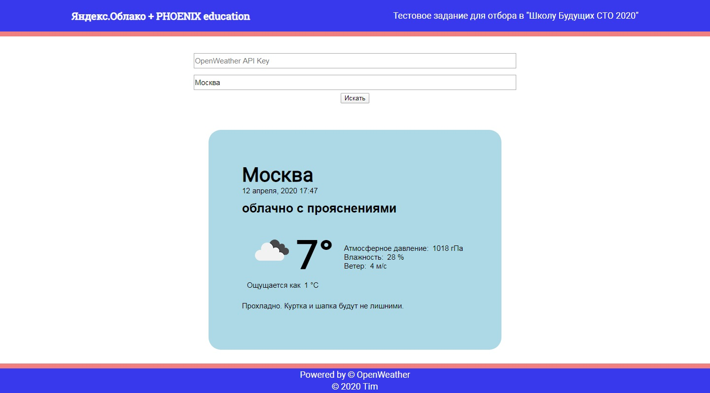

# TestTask-3

## Назначение

Тестовое задание для отбора в "Школу Будущих CTO". Апрель 2020.

## Исходные данные для разработки

Разработать "Умный сервис прогноза погоды"

Сервис призван помогать пользователю быстро определить погоду в своем населенном пункте и советовать, а что необходимо надеть сегодня на улицу, чтобы чувствовать себя комфортно.

**Базовый уровень сложности:**

Делаем сервис для москвичей (или любого другого любимого вашего города). Соответственно все данные запрашиваем и выводим относительно этого населенного пункта.

- Сервис получает от пользователя на входе данные, необходимые для формирования запроса на API. Данные пользователь указывает самостоятельно в поля ввода.
- Формирует запрос на API .
- Из полученных с API данных формирует ответ.
- Отображает информацию пользователю.

**Средний уровень сложности:**

- [`Дополнительно`] Сервис получает от пользователя данные о том, где живет (страна, регион, город). Данные о местонахождении пользователь должен указывать самостоятельно в поля ввода.

**Задача со звездочкой:**

- [`Дополнительно`] Чтобы сервис прогноза погоды считался по настоящему умным, он должен также выводить "а что рекомендуется пользователю надеть с учетом прогноза погоды на день".

## Требования к проекту

Написать программу, которая выполняет требования, выложить ее на Git репозиторий и оформить **readme.md** файл, проработав и описав следующие пункты:

- Какой язык программирования и технологии использованы для реализации данного сервиса
- Какой будет пользовательский интерфейс
- Описать формат ответа, который вернется пользователю со стороны сервера и процесс его генерации
- Продемонстрировать работу сервиса (например, экранное видео)
- Пошагово описать весь процесс работы программы
- Написать пошаговую инструкцию, как запустить вашу программу залив ее с гита

## Критерии оценки

- Работоспособность программы и соответствие требованием
- Отказоустойчивость. Программа должна корректно обрабатывать ошибки
- Чистота кода

## Краткое описание

Проект представляет собой одностраничный web-сайт с

 - формой для ввода ключа доступа к Open Weather API и поискового запроса (город, регион, страна или индекс).
 - виджетом для отображения погодной информации

 

Виджет содержит в себе следующую информацию:

 - Название локации, для которой был получен ответ от сервера.
 - Отметка времени, когда погодная информация была зарегистрирована. Это не время обращения к серверу и не текущее время в искомой локации, а именно показатель т.н. "свежести" полученных данных. Вычисляется относительно локального системного времени клиента, который выполняет запрос.
 - Краткая характеристика атмосферных явлений.
 - Пиктограмма атмосферной характеристики.
 - Текущее значение температуры.
 - Значение "ощущаемой" температуры.
 - Атмосферное давление.
 - Влажность.
 - Скорость ветра.
 - Краткая рекомендация о том, как лучше одеться и о чём побеспокоиться на текущий момент времени. Текст рекомендации формируется на основе текущей атмосферной характеристики (ясно/дождь/снег/торнадо и т.п.) и текущим показаниям температуры.

**Демонстрация работы (gif):**

 

 Сайт +/- адаптирован к разрешениям от 1440px до 320px с применением flex/grid layout, практически без media-запросов.

 Поля формы подвергаются минимальной простейшей валидации средствами html (пустое поле, минимальная длина, максимальная длина).

## Актуальная версия

 - Исходники: [v1.0.0](https://github.com/jasper7466/TestTask-3/tree/v1.0.0)
 - Работающая web-станица: https://jasper7466.github.io/TestTask-3/

## Как развернуть проект

Проект собирается с помощью статического модульного сборщика Webpack.

Установка плагинов осуществляется через [Node Package Manager (NPM)](https://nodejs.org/en/download/).

Версии пакетов и их зависимостей зафиксированы в файлах `package.json` и `npm-shrinkwrap.json`, поэтому для автоматической установки достаточно выполнить команду `npm install` в корневой директории проекта.

В конфигурационном файле настроены три варианта запуска сборки проекта:

 - **build** - компиляция. Проект собирается локально, продукты сборки сохряняются в указанной директории (в моём случае это "./dist").
 - **dev** - отладка. Проект запускается на локальном сервере с автоматической "горячей" пересборкой и перезагрузкой при внесении изменений в исходные коды.
 - **deploy** - релиз. Проект собирается и публикуется в ветку "gh-pages" указанного репозитория.

## Модули и утилиты, используемые в проекте

#### OpenWeather

Класс, реализующий все операции, касающиеся получения/парсинга/анализа погодной информации:
- Выполнение асинхронных запросов к серверу (OpenWeatherMap API)
- Получение ответов и их парсинг в удобный для дальнейшей работы формат
- Анализ данных и формирование рекомендаций

Конструктор на вход принимает токен для доступа к API (опционально). Для обеспечения возможности работы сайта без публикации хардкод-ключа реализована возможность его считывания от пользователя и передачи в экземпляр класса уже после его инициализации.

Основной полезный для пользователя метод - getWeather(query).
На вход получает строку-запрос.
На выход отдаёт промис, в котором впоследствии будет сформирован объект со специфичным набором полей.

#### DateParser

Модуль с утилитой dateParser(date) для работы с тайм-стемпами в UTC/unix-формате.
На вход принимает число секунд (если unix-формат, то предваритеольно нужно домножить на 1000).
На выход отдаёт обект, поля которого содержат различные компоненты даты/времени в человекочитаемом формате (язык - ru).

#### InputForm

Класс, экспортируемый из блока "input" для работы с формой ввода этого модуля, прибит к нему гвоздями.
На самом деле, особого смысла не имеет. Он просто прячет в себе два метода - lock() и unlock(), которые нужны для блокировки графического интерфейса на промежуток времени между отправкой запроса и получением ответа от сервера. С ним описание бизнес-логики становится чуточку читабельнее.

Можно было бы написать абстрактный класс для генерации форм по шаблонам и работы с ними (см. проект "Mesto", класс classPopup.js), но тут она одна и вроде как смысла нету...

#### Weather

Класс, экспортируемый из блока "input" для работы с виджетом отображения погоды, также привязан к вёрстке блока.
Конструктор на вход принимает ссылку на DOM-узел, который станет родительским для виджета, вёрстка сразу же синтезируется и помещается в структруру html-документа, но с модификатором "_hidden" (display: none). Код вёрстки потенциально не опасен, поэтому вставка осуществляется через метод "insertAdjacentHTML". На этапе синтеза извлекаются ссылки на необходимые элементы виджета для вставки значений.

Основной полезный для пользователя метод - directUpdate(data). На вход принимает объект со специфическим набором полей (тот самый, который возращает модуль OpenWeather). Данные извлекаются из полей и помещаются в узлы виджета. Вставка осуществляется безопасным способом, через свойство "textContent", поэтому предварительная проверка на потенциальные попытки XSS-атак - не выполняется.

Помимо отбражения основной инфомации, виджет включает в себя баннер для вывода прелоудера (пока ждём ответ от сервера) и возможных ошибок (если что-то пошло не так). Парсятся и приводятся к понятному виду два кода ошибки: 401 - ошибка авторизации и 404 - ничего не найдено. Остальные коды будут отображены в сыром, но вполне читабельном виде.

## Алгоритм работы

Основная логика работы хорошо прослеживается по коду файла index.js

1. Получаем ссылки на нужные узлы DOM-структуры
2. Объявляем нужные экземпляры классов
3. Объявляем функцию-обработчик события "submit" от формы ввода
4. Передаём её в слушатель события "submit" формы ввода

Когда пользователь заполнил форму (без ошибок валидации) и инициировал её отправку по нажатию на кнопку:

1. Форма блокируется для действий пользователя
2. Отображается погодный виджет с включенным прелоудером
3. Ключ доступа к API забирается из поля ввода и передаётся в экземпляр класса OpenWeather
4. Поисковый запрос забирается из поля ввода и передаётся в качестве аргумента метода getWeather(query)
5. Пока запрос обрабатывается - получаем промис
6. В случае успешного завершения запроса получаем объект с набором данных и передаём его в качестве аргумента в метод directUpdate(data) погодного виджета и прячем баннер-прелоудер на виджете.
7. Если что-то пошло не так - отлавливаем исключение и передаём его в метод bannerError(err) для отображения на баннере
8. При любом из двух предыдущих вариантов - выполняем разблокировку формы для дальнейшего взаимодействия пользовтаеля с ней

## Технологии

 - HTML
 - JS
 - CSS
 - БЭМ
 - Git
 - Webpack

 ## Известные проблемы и что можно улучшить

- Валидация ввода. Реализовать её можно средствами JS с более детальной проработкой (например, перехват недопустимых символов и предотвращение ошибок на этапе ввода) и более красивым и адаптивным способом отображения всплывающих подсказок. На данный момент валидация отдана на откуп API. Как выяснилось, они довольно всеядные и могут отобразить погоду не просто города, а даже региона или страны (видимо, по какой-то опорной координате или координате географического центра), что не совсем корректно.

- Добавить виджет с картой и возможностью выбирать на ней координаты с последующей передачей в запросе. Конкретно данные API такой функционал предоставляют.

- Рекомендации формируются не по прогнозу на день, а на текущее время, что не совсем честно.

- Для большей устойчивости можно реализовать работу сразу с несколькими сервисами. Для этого перед виджетом должна появиться прослойка-агрегатор данных от разных API, которая будет производить их парсинг, анализ и принятие решения об отображении.
